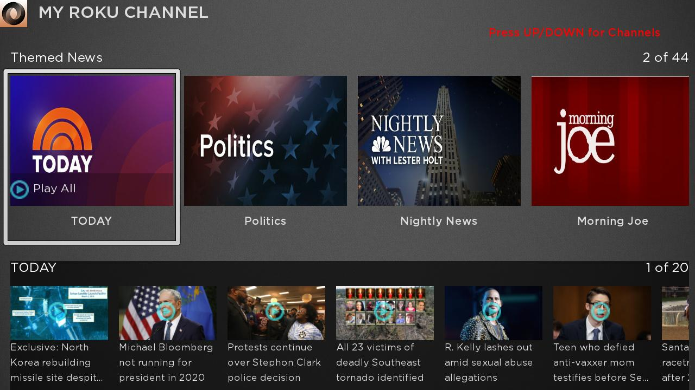
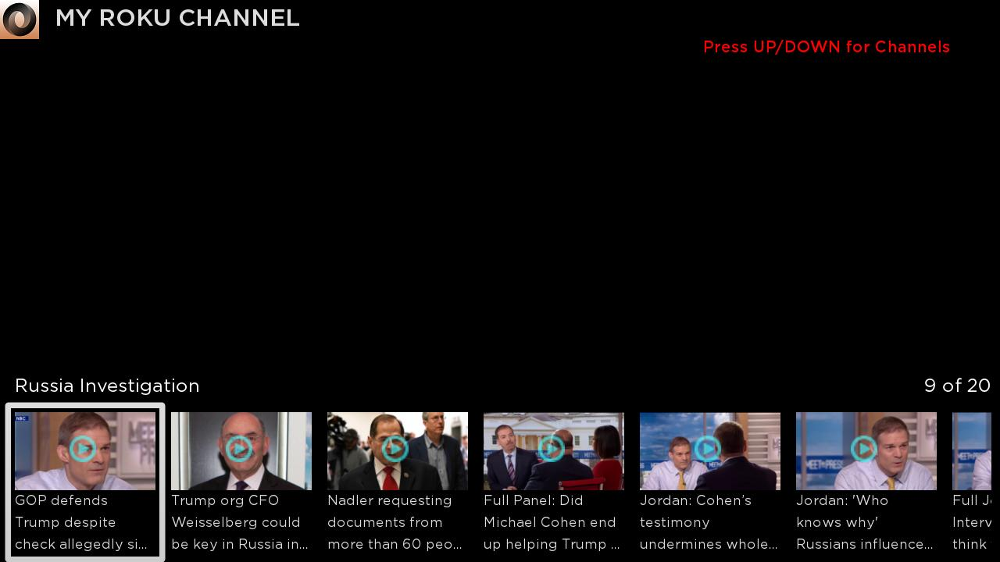

# Features:

* Main menu for browsing playlist/category and all videos in it that show titles and thumbnails.

* Select Playlist/Category can playback all videos in the playlist, also can play every single video clip when choosing one in video list.

* Above the continuously-running main video, pressing UP/DOWN button to select single video clip to playback.

* Display resolution is intended for HD, tested on FHD and worked well. 

# Screenshots:
* Main scene
           -

        -
* Video playback screen (video content not captured)
             -

        -
        
#Directory Structure
* Components: SceneGraph Components
     - *HomeScene.brs* - Show Category and Video RowList, handles content showing and channel change events, as well as tracks and monitors video playback.
     - *HomeScene.xml* - Creates all SceneGraph nodes displayed in the UI
     - CustomFocusItem 
       - *CustomCategoryItem.brs* - Customized component for category row item, handle layout update 
       - *CustomCategoryItem.xml* - manage all nodes displayed on the category row item 
       - *CustomVideoItem.brs* - Customized component for video row item, handle layout update 
       - *CustomVideoItem.xml* - manage all nodes displayed on the video row item  
     - FeedReader
       - *FeedReader.brs* - Read online JSON to store in the content node 

* Source: Contains Main method
     - *Main.brs* - Creates screen to display UI. 
     
#Known issues 
1. When switching playlist/category, sometimes it takes time to load all videos clips (may need to improve the design)
2. Need to handle details on text showing, key event and dialog messages etc.
    
